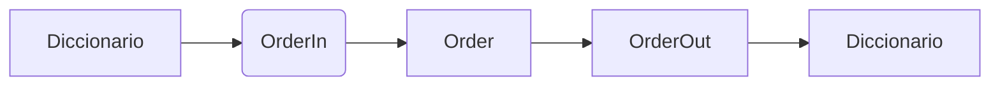

# Laboratorio 04 — Objetos y modelos de datos

## Objetivo

Modelar una orden mediante clases de datos y modelos de validación.

El laboratorio implementa:

- Una entidad `Order` mediante `dataclass`.
- Una entidad `OrderItem` para representar los artículos.
- Cálculos derivados de subtotal y total.
- Comparación entre órdenes.
- Modelos Pydantic de entrada y salida.
- Conversión entre modelos Pydantic y entidades.

## Conceptos utilizados

### Clases y objetos

Una clase define la estructura y el comportamiento de un tipo de objeto.

En este laboratorio, `Order` representa una orden y `OrderItem` representa
cada artículo contenido en ella.

### Dataclasses

El decorador `@dataclass` genera automáticamente métodos como el constructor
y la representación del objeto.

Esto permite crear clases enfocadas principalmente en almacenar datos sin
escribir manualmente código repetitivo.

### Composición

La clase `Order` contiene una lista de objetos `OrderItem`.

Esto representa una relación de composición, porque una orden tiene uno o
varios artículos.

### Propiedades calculadas

Los atributos `subtotal` y `total` se implementaron mediante `@property`.

El subtotal se obtiene sumando los subtotales de los artículos.

El total se calcula aplicando el descuento al subtotal.

### Método `__post_init__`

El método `__post_init__()` se ejecuta después de crear una instancia de una
dataclass.

Se utiliza para comprobar que:

- La orden contenga al menos un artículo.
- El descuento se encuentre entre 0 y 1.

### Método `__lt__`

El método especial `__lt__()` permite comparar dos órdenes mediante el
operador `<`.

La comparación se realiza utilizando el total de cada orden.

### Pydantic

Pydantic permite validar los datos recibidos antes de crear una entidad.

Los modelos implementados son:

- `OrderItemIn`: valida un artículo de entrada.
- `OrderIn`: valida los datos necesarios para crear una orden.
- `OrderOut`: representa la información de salida.

### Conversión de modelos

El flujo utilizado es:



`OrderIn` valida los datos externos, `Order` contiene los cálculos y
`OrderOut` presenta la información resultante.

## Clases implementadas

- `OrderItem`
- `Order`
- `OrderItemIn`
- `OrderIn`
- `OrderOut`

## Funciones implementadas

- `convert_to_entity()`: convierte un modelo `OrderIn` en una entidad `Order`.
- `convert_to_output()`: convierte una entidad `Order` en un modelo
  `OrderOut`.
- `main()`: ejecuta las demostraciones del laboratorio.

## Validaciones realizadas

Pydantic comprueba:

- Que el código de orden tenga el formato `ORD-0000`.
- Que el nombre del cliente no esté vacío.
- Que exista al menos un artículo.
- Que la cantidad sea mayor que cero.
- Que el precio sea mayor o igual que cero.
- Que el descuento esté entre 0 y 1.

## Ejecución

Desde la raíz del proyecto:

```cmd
poetry run python labs\04_objects_models\main.py
```

## Resultado esperado

El programa:

1. Valida dos órdenes correctas.
2. Convierte los modelos de entrada en entidades.
3. Calcula subtotal y total.
4. Convierte las entidades en modelos de salida.
5. Compara las órdenes según su total.
6. Rechaza un conjunto de datos inválidos.

## Validación de calidad

```cmd
poetry run ruff check .
poetry run isort --check-only .
poetry run black --check .
poetry run pre-commit run --all-files
```

## Evidencia

La salida de la ejecución se encuentra en:

```text
docs/evidence/lab04_execution.txt
```

## Resultado

Se modelaron correctamente las órdenes y sus artículos mediante dataclasses.
También se validaron y serializaron datos utilizando modelos Pydantic.