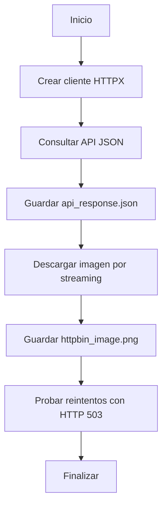

# Laboratorio 07 — HTTP y consumo de APIs

## Objetivo

Construir un cliente HTTP robusto mediante HTTPX que permita:

- Consultar una API que devuelve JSON.
- Configurar límites de espera o timeouts.
- Manejar errores de red y códigos HTTP.
- Reintentar operaciones que presentan fallos temporales.
- Aplicar espera progresiva o backoff.
- Descargar un archivo mediante streaming.
- Guardar respuestas y archivos en disco.
- Registrar el proceso mediante logging.

Este laboratorio completa el Fundamental Level del curso.

## Servicio utilizado

El temario menciona Smocker, pero no se proporcionó una instancia ni una
configuración para utilizarlo.

Por esa razón, el laboratorio utiliza httpbin como servicio público de pruebas
HTTP.

Las rutas utilizadas son:

```text
https://httpbin.org/json
https://httpbin.org/image/png
https://httpbin.org/status/503
```

Cada una permite comprobar una parte distinta del cliente:

- `/json`: respuesta JSON correcta.
- `/image/png`: descarga de un archivo.
- `/status/503`: error temporal utilizado para probar los reintentos.

## Flujo del programa



## Estructura

```text
labs/07_http_api/
├── logs/
│ └── http_client.log
├── output/
│ ├── api_response.json
│ └── httpbin_image.png
├── main.py
└── README.md
```

Los archivos de salida y logging se generan durante la ejecución.

## Conceptos utilizados

### HTTPX

HTTPX es la biblioteca utilizada para realizar solicitudes HTTP.

Se instaló como dependencia del proyecto mediante:

```cmd
poetry add httpx
```

El laboratorio utiliza su interfaz síncrona porque la asincronía se estudia en
módulos posteriores.

### Cliente HTTP reutilizable

Se utiliza un objeto `httpx.Client`:

```python
with httpx.Client(
    timeout=timeout,
    follow_redirects=True,
    headers={
        "User-Agent": "python-training-orders/1.0",
        "Accept": "application/json, image/png",
    },
) as client:
```

El cliente mantiene una configuración común y permite reutilizar conexiones
entre solicitudes.

### Timeouts

El cliente se configura con:

```python
timeout = httpx.Timeout(
    timeout=10.0,
    connect=5.0,
)
```

El tiempo de conexión se limita a cinco segundos y las demás operaciones
utilizan un límite de diez segundos sin progreso.

Esto evita que una solicitud permanezca esperando indefinidamente.

### Códigos HTTP

Después de recibir una respuesta se utiliza:

```python
response.raise_for_status()
```

Los códigos `4xx` y `5xx` generan un `HTTPStatusError`.

El laboratorio considera reintentables los siguientes códigos:

```text
429
500
502
503
504
```

Estos códigos pueden representar errores temporales o saturación del servicio.

Errores como `400`, `401`, `403` o `404` no se reintentan porque normalmente
requieren corregir la solicitud o los permisos.

### Reintentos

La función `get_with_retries()` realiza hasta tres intentos.

Los reintentos se producen cuando ocurre:

- Un error de conexión.
- Un timeout.
- Un código HTTP considerado temporal.

Cuando se alcanza el máximo de intentos, la excepción vuelve a propagarse para
que sea manejada por la función principal.

### Backoff

La espera entre intentos aumenta progresivamente.

Con un retraso inicial de `0.5` segundos:

```text
Primer fallo: 0.5 segundos
Segundo fallo: 1.0 segundos
Tercer retraso posible: 2.0 segundos
```

Este crecimiento reduce la cantidad de solicitudes realizadas contra un
servicio que presenta problemas.

### Streaming

La descarga se procesa por fragmentos:

```python
for chunk in response.iter_bytes(chunk_size=8192):
    file.write(chunk)
```

Esto evita cargar el archivo completo en memoria antes de guardarlo.

El tamaño de cada fragmento es de 8192 bytes.

### Archivo temporal

La imagen se escribe primero con extensión temporal:

```text
httpbin_image.png.part
```

Cuando la descarga termina correctamente, el archivo temporal sustituye al
archivo final:

```text
httpbin_image.png
```

Si la descarga falla, el archivo temporal se elimina.

Esto evita conservar archivos finales incompletos.

### Respuestas JSON

La respuesta de la API se convierte mediante:

```python
data = response.json()
```

Después se comprueba que el nivel principal sea un diccionario.

Finalmente, se guarda en:

```text
output/api_response.json
```

### Logging

Los mensajes se registran en:

- La consola.
- `logs/http_client.log`.

Se utilizan principalmente los niveles:

- `INFO`: operaciones completadas.
- `WARNING`: intento fallido que será repetido.
- `ERROR`: error definitivo.

El logging interno de HTTPX se configura como `WARNING` para evitar mensajes
adicionales en cada solicitud correcta.

### Manejo de errores

El programa controla:

- `httpx.TimeoutException`
- `httpx.HTTPStatusError`
- `httpx.RequestError`
- `json.JSONDecodeError`
- `ValueError`
- `OSError`

Esto permite diferenciar errores de tiempo, respuestas HTTP, red, JSON y
escritura de archivos.

## Funciones implementadas

### `configure_logging()`

Configura los mensajes en consola y archivo.

### `is_retryable_status()`

Determina si un código HTTP puede volver a intentarse.

### `wait_before_retry()`

Registra el fallo y realiza la espera antes del siguiente intento.

### `get_with_retries()`

Realiza una solicitud GET con reintentos y backoff.

### `fetch_json()`

Consulta una API y devuelve el objeto JSON recibido.

### `save_json()`

Guarda la respuesta JSON en disco.

### `download_streaming()`

Descarga un archivo por fragmentos y utiliza un archivo temporal.

### `demonstrate_retries()`

Consulta una ruta que responde con HTTP 503 para comprobar el funcionamiento
de los reintentos.

### `main()`

Configura el cliente y coordina el flujo completo.

## Ejecución

Desde la raíz del proyecto:

```cmd
poetry run python labs\07_http_api\main.py
```

## Resultado esperado

El programa debe:

1. Consultar correctamente la API JSON.
2. Guardar `api_response.json`.
3. Descargar y guardar `httpbin_image.png`.
4. Ejecutar tres intentos contra la ruta que devuelve HTTP 503.
5. Registrar dos esperas progresivas.
6. Reconocer que el error 503 final forma parte de la prueba.
7. Finalizar sin detener el programa.

La salida debe ser semejante a:

```text
INFO | Inicio del laboratorio de consumo HTTP.
INFO | Consultando la API
INFO | La API respondió correctamente con código 200.
INFO | La respuesta JSON fue guardada.
INFO | Archivo descargado correctamente.
INFO | Iniciando prueba controlada de reintentos.
WARNING | Intento 1 fallido: código HTTP 503.
WARNING | Intento 2 fallido: código HTTP 503.
INFO | La prueba terminó como se esperaba con código HTTP 503.

Procesamiento HTTP completado.
```

## Archivos generados

```text
labs/07_http_api/output/api_response.json
labs/07_http_api/output/httpbin_image.png
labs/07_http_api/logs/http_client.log
```

El archivo `.log` puede quedar excluido del repositorio mediante `.gitignore`.

Los archivos JSON y PNG no contienen información privada y pueden conservarse
como ejemplos del resultado del laboratorio.

## Validación de calidad

```cmd
poetry run ruff check .
poetry run isort --check-only .
poetry run black --check .
poetry run mypy
poetry run pre-commit run --all-files
```

Mypy continúa analizando solamente el archivo configurado en el Laboratorio 5.

## Evidencias

- `docs/evidence/lab07_execution.txt`
- `docs/evidence/lab07_ruff.txt`
- `docs/evidence/lab07_precommit.txt`

## Resultado

Se implementó un cliente HTTP síncrono con HTTPX que utiliza timeouts,
reintentos, backoff, manejo de errores y streaming.

La respuesta JSON y el archivo descargado se guardaron correctamente en disco,
y la prueba controlada con HTTP 503 demostró el funcionamiento del mecanismo
de reintentos.