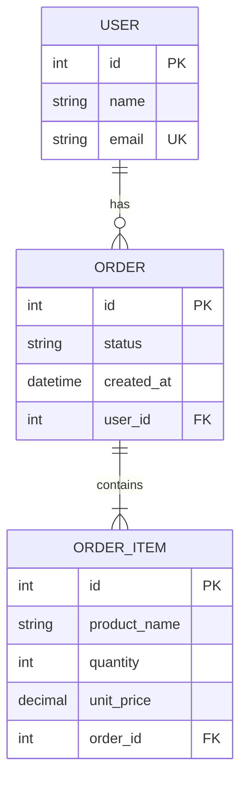
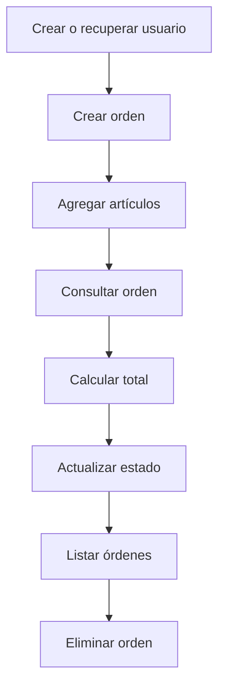

# Laboratorio 08 — Acceso a datos y ORM

## Objetivo

Implementar una capa básica de acceso a datos utilizando SQLAlchemy ORM,
SQLite y Alembic.

El laboratorio incluye:

- Modelos ORM para usuarios, órdenes y artículos.
- Relaciones entre entidades.
- Operaciones CRUD.
- Una base SQLite local.
- Una migración gestionada mediante Alembic.
- Pruebas automatizadas con SQLite en memoria.

Este es el primer laboratorio del Intermediate Level.

## Estructura

```text
src/orders_service/data_access/
├── __init__.py
├── crud.py
├── database.py
├── demo.py
└── models.py

labs/08_data_access_orm/
├── migrations/
│   ├── versions/
│   ├── env.py
│   └── script.py.mako
└── README.md

tests/data_access/
├── conftest.py
└── test_crud.py
```

La base local se genera en:

```text
labs/08_data_access_orm/orders.db
```

El archivo de base de datos está excluido del repositorio mediante
`.gitignore`.

## Tecnologías utilizadas

### SQLAlchemy

SQLAlchemy se utilizó para definir modelos, relaciones y consultas mediante
un ORM.

El código utiliza el estilo moderno de SQLAlchemy 2:

- `DeclarativeBase`
- `Mapped`
- `mapped_column()`
- `relationship()`
- `select()`
- `Session`

### SQLite

SQLite se utiliza como base de datos local porque no necesita un servidor
independiente.

El laboratorio utiliza dos modalidades:

- Un archivo `orders.db` para la demostración.
- Una base en memoria para las pruebas.

### Alembic

Alembic se utiliza para administrar cambios en el esquema de la base de datos.

La migración inicial crea:

- La tabla `users`.
- La tabla `orders`.
- La tabla `order_items`.
- Llaves primarias.
- Llaves foráneas.
- Índices.
- Restricciones de validación.

### Pytest

Pytest ejecuta las pruebas automatizadas del CRUD.

Cada prueba recibe una base SQLite en memoria recién creada, por lo que no
depende del archivo `orders.db`.

## Modelo de datos



## Entidades

### `User`

Representa un usuario registrado.

Campos:

- `id`
- `name`
- `email`

Un usuario puede tener varias órdenes.

### `Order`

Representa una orden perteneciente a un usuario.

Campos:

- `id`
- `status`
- `created_at`
- `user_id`

La propiedad `total` suma los subtotales de los artículos.

### `OrderItem`

Representa un artículo contenido en una orden.

Campos:

- `id`
- `product_name`
- `quantity`
- `unit_price`
- `order_id`

La propiedad `subtotal` multiplica la cantidad por el precio unitario.

## Relaciones

Las relaciones implementadas son:

```text
User 1 ─── N Order
Order 1 ─── N OrderItem
```

Desde los objetos ORM se puede navegar mediante:

```python
user.orders
order.user
order.items
item.order
```

Las relaciones utilizan:

```python
back_populates
```

para mantener ambos lados sincronizados.

También se utiliza:

```python
cascade="all, delete-orphan"
```

para eliminar objetos dependientes cuando se eliminan mediante el ORM.

## Manejo de importes

Los precios se representan mediante:

```python
Decimal
```

Y en la base mediante:

```python
Numeric(10, 2)
```

Esto permite representar importes monetarios con dos decimales sin depender de
la aproximación binaria de `float`.

## Restricciones

La tabla `order_items` incluye restricciones para garantizar que:

- `quantity` sea mayor que cero.
- `unit_price` sea mayor o igual que cero.

También se realizan validaciones antes de guardar la orden en las funciones
CRUD.

## Operaciones CRUD

### Create

```python
create_user()
create_order()
```

### Read

```python
get_user_by_email()
get_order_by_id()
list_orders()
```

### Update

```python
update_order_status()
```

### Delete

```python
delete_order()
```

## Sesiones y transacciones

`SessionLocal` es una fábrica de sesiones vinculada al engine de SQLite.

Las funciones CRUD utilizan:

```python
session.add()
session.commit()
session.refresh()
session.delete()
```

Una sesión agrupa las operaciones realizadas contra la base de datos.

## Carga de relaciones

La consulta de órdenes utiliza:

```python
selectinload(Order.items)
```

Esto carga los artículos asociados a las órdenes y permite utilizar la
propiedad `total` después de realizar la consulta.

## Demostración

La demostración realiza el siguiente flujo:



Se ejecuta mediante:

```cmd
poetry run python -m orders_service.data_access.demo
```

El programa:

1. Crea o recupera un usuario.
2. Crea una orden con dos artículos.
3. Calcula un total de 1200.00.
4. Consulta la orden.
5. Cambia el estado a `completed`.
6. Lista las órdenes.
7. Elimina la orden.

## Migraciones

Alembic fue inicializado en:

```text
labs/08_data_access_orm/migrations
```

La configuración se encuentra en:

```text
alembic.ini
```

Los modelos ORM se vinculan con Alembic mediante:

```python
target_metadata = Base.metadata
```

### Generar una migración

```cmd
poetry run alembic revision --autogenerate -m "description"
```

### Aplicar migraciones

```cmd
poetry run alembic upgrade head
```

### Consultar la revisión actual

```cmd
poetry run alembic current
```

### Consultar el historial

```cmd
poetry run alembic history
```

### Revertir las migraciones

```cmd
poetry run alembic downgrade base
```

Después de una prueba de downgrade, la base puede restaurarse con:

```cmd
poetry run alembic upgrade head
```

## Pruebas

Las pruebas se encuentran en:

```text
tests/data_access/test_crud.py
```

Se comprueba:

- Creación y consulta de usuarios.
- Creación de órdenes y artículos.
- Cálculo del total.
- Actualización del estado.
- Eliminación de órdenes.

Ejecución:

```cmd
poetry run pytest tests\data_access -v
```

Resultado esperado:

```text
4 passed
```

## SQLite en memoria

La fixture de pruebas crea la base mediante:

```python
sqlite+pysqlite:///:memory:
```

También utiliza:

```python
StaticPool
```

para mantener la misma conexión durante cada prueba.

Antes de la prueba:

```python
Base.metadata.create_all(engine)
```

Después de la prueba:

```python
Base.metadata.drop_all(engine)
```

Esto proporciona aislamiento entre pruebas.

## Dependencias agregadas

```cmd
poetry add sqlalchemy alembic
poetry add --group dev pytest
```

## Validación de calidad

```cmd
poetry run ruff check .
poetry run isort --check-only .
poetry run black --check .
poetry run mypy
poetry run pytest tests\data_access -v
poetry run pre-commit run --all-files
```

## Evidencias

- `docs/evidence/lab08_demo.txt`
- `docs/evidence/lab08_pytest.txt`
- `docs/evidence/lab08_alembic_current.txt`
- `docs/evidence/lab08_alembic_history.txt`
- `docs/evidence/lab08_ruff.txt`

## Resultado

Se implementó una capa de acceso a datos mediante SQLAlchemy ORM.

Los modelos `User`, `Order` y `OrderItem` fueron relacionados correctamente,
las operaciones CRUD funcionaron sobre SQLite, la migración inicial fue
generada y aplicada mediante Alembic, y las pruebas finalizaron correctamente
utilizando una base en memoria.